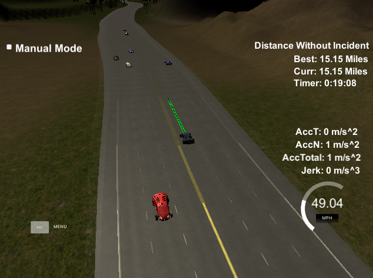

## Udacity Self Driviing Car Nanodegree - Term 3 - Project 1 --Path Planning

### Objective of the project
 We design a path planning system to generate a path for car to follow smoothly, safely move between three lane highway.

### rubric Goal
1. no accident during driving. 
2. do not exceed the speed limit.
3. do not exceed the Acceleration and Jerk limit.
4. do not hit another car.
5. stay inside lane.
6. able to change lanes.

### Achieved rubric 
1. The Car is able to drive over 15 miles without incident

